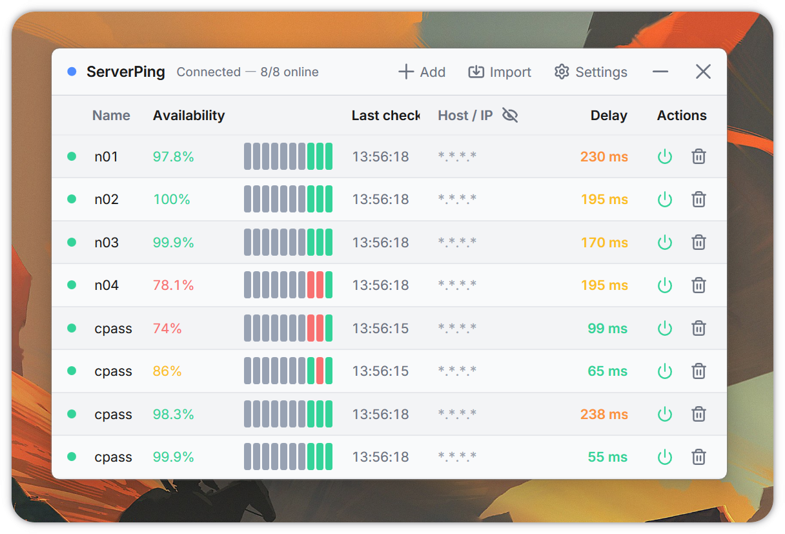

  
  <h1 align="center">Server Ping</h1>
  
A lightweight Windows app for monitoring server availability from the tray.

  <a href="README.md">English</a>
  ·
  <a href="README.zh-CN.md">简体中文</a>

  

## Features

- **Low background usage**: built with WPF and a small resident service, so monitoring can stay on without getting in your way.
- **Timely sound notifications**: enable sound alerts when a server goes offline and get feedback right away.
- **Clean modern interface**: manage servers, settings, status, and availability stats in a simple Windows-native UI.
- **Automatic config**: import SSH connection profiles directly from Windows Terminal.

## Requirements

- **Windows**: Windows 10 1809 or later. Windows 10 22H2 and Windows 11 are recommended.

## Download

[Go to Releases](../../releases)

Two builds are provided:

- **With .NET included**: larger download, runs without installing the .NET runtime. Recommended.
- **Without .NET included**: smaller download, requires the .NET 9 Desktop Runtime to be installed. [Download .NET 9 here](https://dotnet.microsoft.com/en-us/download/dotnet/9.0).

Both builds behave the same and use the same resources at runtime.

## License

Server ping is licensed under the **GPL-3.0** license.

## Thanks

- Icons by [Lucide](https://lucide.dev/).
